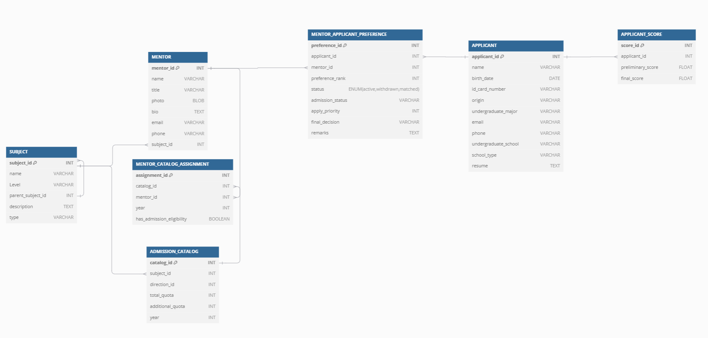
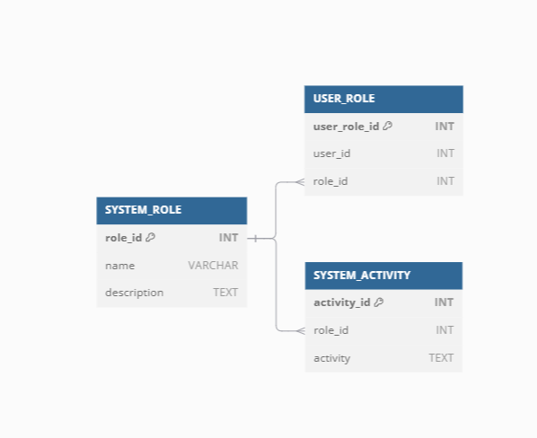

# 数据库 TASK3 设计说明文档

Completed by Yukun Huang and Yiqi Xu

## TASK3 需求分析

1. 导师分配：在复试结束后，根据学生志愿和成绩为学生分配导师。
2. 导师学生匹配结果：记录学生与导师的匹配关系，包括匹配年度和确认状态等信息。

---

## 基于 TASK3 的表结构说明

### 1. SUBJECT 表

- **描述**：存储学科信息，每个学科有唯一的 `subject_id`，并可能有父学科。
- **字段**：
  - `subject_id` (INT, PK)：学科 ID，主键。
  - `name` (VARCHAR)：学科名称。
  - `Level` (VARCHAR)：学科等级。
  - `parent_subject_id` (INT, FK)：上级学科 ID（外键，指向自身）。
  - `description` (TEXT)：学科描述。
  - `type` (VARCHAR)：学科类型。
- **关系**：`parent_subject_id` 字段实现了学科的自关联，表示学科的层级结构。

---

### 2. MENTOR 表

- **描述**：存储导师信息，包括导师的个人资料、联系方式及其所属的学科。
- **字段**：
  - `mentor_id` (INT, PK)：导师 ID，主键。
  - `name` (VARCHAR)：导师姓名。
  - `title` (VARCHAR)：导师职称。
  - `photo` (BLOB)：导师照片。
  - `bio` (TEXT)：导师简介。
  - `email` (VARCHAR)：导师邮箱。
  - `phone` (VARCHAR)：导师电话。
  - `subject_id` (INT, FK)：学科 ID（外键，关联 `SUBJECT` 表）。
- **关系**：每位导师属于一个学科，通过 `subject_id` 关联到 `SUBJECT` 表。

---

### 3. APPLICANT 表

- **描述**：存储学生的基本信息及其背景资料。
- **字段**：
  - `applicant_id` (INT, PK)：考生 ID，主键。
  - `name` (VARCHAR)：考生姓名。
  - `birth_date` (DATE)：考生出生日期。
  - `id_card_number` (VARCHAR)：考生身份证号。
  - `origin` (VARCHAR)：考生籍贯。
  - `undergraduate_major` (VARCHAR)：考生本科专业。
  - `email` (VARCHAR)：考生邮箱。
  - `phone` (VARCHAR)：考生电话。
  - `undergraduate_school` (VARCHAR)：本科院校。
  - `school_type` (VARCHAR)：本科院校类型。
  - `resume` (TEXT)：考生简历。
- **关系**：每位考生与导师、招生目录、志愿表等表有多对多或一对多的关系。

---

### 4. ADMISSION_CATALOG 表

- **描述**：存储每年的招生目录信息，包括招生学科、方向及招生人数。
- **字段**：
  - `catalog_id` (INT, PK)：目录 ID，主键。
  - `subject_id` (INT, FK)：学科 ID（外键，关联 `SUBJECT` 表）。
  - `direction_id` (INT)：研究方向编号。
  - `total_quota` (INT)：年度招生指标。
  - `additional_quota` (INT)：补充名额指标。
  - `year` (INT)：招生年份。
- **关系**：每条招生目录与一个学科相关，通过 `subject_id` 关联到 `SUBJECT` 表。

---

### 5. MENTOR_CATALOG_ASSIGNMENT 表

- **描述**：记录导师在某一年招生目录中的分配情况。
- **字段**：
  - `assignment_id` (INT, PK)：分配记录 ID，主键。
  - `catalog_id` (INT, FK)：招生目录 ID（外键，关联 `ADMISSION_CATALOG` 表）。
  - `mentor_id` (INT, FK)：导师 ID（外键，关联 `MENTOR` 表）。
  - `year` (INT)：分配年份。
  - `has_admission_eligibility` (BOOLEAN)：是否具备招生资格。
- **关系**：每条分配记录将导师和招生目录进行关联。

---

### 7. APPLICANT_SCORE 表

- **描述**：记录考生的成绩信息，包括初试和复试成绩，用于导师分配的参考。
- **字段**：
  - `score_id` (INT, PK, AUTO_INCREMENT)：成绩记录 ID，主键，自动递增。
  - `applicant_id` (INT, FK)：考生 ID（外键，关联 `APPLICANT` 表）。
  - `preliminary_score` (FLOAT)：考生初试成绩。
  - `final_score` (FLOAT)：考生复试成绩。
- **关系**：通过 `applicant_id` 与 `APPLICANT` 表关联，表示每位考生的初试和复试成绩。

---

### 8. MENTOR_APPLICANT_PREFERENCE 表

- **描述**：记录学生的导师选择优先级及其志愿状态。
- **字段**：
  - `preference_id` (INT, PK)：志愿记录 ID，主键。
  - `applicant_id` (INT, FK)：考生 ID（外键，关联 `APPLICANT` 表）。
  - `mentor_id` (INT, FK)：导师 ID（外键，关联 `MENTOR` 表）。
  - `preference_rank` (INT)：志愿优先级。
  - `status` (ENUM)：志愿状态，可能值为 'Pending', 'Accepted', 'Rejected'，默认为 'Pending'。
  - `remarks` (TEXT)：备注信息。
- **关系**：此表用于记录学生与导师的志愿选择及状态。

---

### 9. SYSTEM_ROLE 表

- **描述**：存储系统中的角色信息，如学生、导师、管理员等。
- **字段**：
  - `role_id` (INT, PK)：角色 ID，主键。
  - `name` (VARCHAR)：角色名称。
  - `description` (TEXT)：角色描述。
- **关系**：角色表为用户和活动提供权限控制的基础。

---

### 10. USER_ROLE 表

- **描述**：记录用户的角色信息，实现用户和角色的多对多关联。
- **字段**：
  - `user_role_id` (INT, PK)：用户角色关联 ID，主键。
  - `user_id` (INT)：用户 ID。
  - `role_id` (INT, FK)：角色 ID（外键，关联 `SYSTEM_ROLE` 表）。
- **关系**：用于实现用户与系统角色的多对多关系。

---

### 11. SYSTEM_ACTIVITY 表

- **描述**：存储系统活动信息，用于记录角色的特定操作权限。
- **字段**：
  - `activity_id` (INT, PK)：活动 ID，主键。
  - `role_id` (INT, FK)：角色 ID（外键，关联 `SYSTEM_ROLE` 表）。
  - `activity` (TEXT)：核心业务需求或活动描述。
- **关系**：每条记录关联一个系统角色和其允许的活动，用于权限控制。

---

## 表之间的关系概述

- **SUBJECT** 与 **MENTOR**、**ADMISSION_CATALOG** 通过 `subject_id` 建立一对多关系，表示每个学科下可以有多个导师和招生目录。
- **APPLICANT** 与 **PREFERRED_MENTOR** 表示一对多关系，通过 **PREFERRED_MENTOR** 表记录学生的导师志愿选择。
- **ADMISSION_CATALOG** 与 **MENTOR_CATALOG_ASSIGNMENT** 通过 `catalog_id` 建立一对多关系，表示每个招生目录可以分配多个导师。
- **APPLICANT** 与 **MENTOR_APPLICANT_MATCHING_RESULTS** 关联，记录每个学生的最终匹配导师和录取结果。
- **SYSTEM_ROLE** 与 **USER_ROLE**、**SYSTEM_ACTIVITY** 形成权限控制系统，用于管理不同角色的操作权限。

---

## ER 图




## DDL

```SQL
-- SUBJECT Table
CREATE TABLE SUBJECT (
    subject_id INT PRIMARY KEY,
    name VARCHAR(100),
    Level VARCHAR(50),
    parent_subject_id INT,
    description TEXT,
    type VARCHAR(50)
);

-- MENTOR Table
CREATE TABLE MENTOR (
    mentor_id INT PRIMARY KEY,
    name VARCHAR(100),
    title VARCHAR(50),
    photo BLOB,
    bio TEXT,
    email VARCHAR(100),
    phone VARCHAR(20),
    subject_id INT,
    FOREIGN KEY (subject_id) REFERENCES SUBJECT(subject_id)
);

-- APPLICANT Table
CREATE TABLE APPLICANT (
    applicant_id INT PRIMARY KEY,
    name VARCHAR(100),
    birth_date DATE,
    id_card_number VARCHAR(20),
    origin VARCHAR(100),
    undergraduate_major VARCHAR(100),
    email VARCHAR(100),
    phone VARCHAR(20),
    undergraduate_school VARCHAR(100),
    school_type VARCHAR(50),
    resume TEXT
);

-- ADMISSION_CATALOG Table
CREATE TABLE ADMISSION_CATALOG (
    catalog_id INT PRIMARY KEY,
    subject_id INT,
    direction_id INT,
    total_quota INT,
    additional_quota INT,
    year INT,
    FOREIGN KEY (subject_id) REFERENCES SUBJECT(subject_id)
);

-- MENTOR_CATALOG_ASSIGNMENT Table
CREATE TABLE MENTOR_CATALOG_ASSIGNMENT (
    assignment_id INT PRIMARY KEY,
    catalog_id INT,
    mentor_id INT,
    year INT,
    has_admission_eligibility BOOLEAN,
    FOREIGN KEY (catalog_id) REFERENCES ADMISSION_CATALOG(catalog_id),
    FOREIGN KEY (mentor_id) REFERENCES MENTOR(mentor_id)
);

-- MENTOR_APPLICANT_PREFERENCE Table
CREATE TABLE MENTOR_APPLICANT_PREFERENCE (
    preference_id INT AUTO_INCREMENT PRIMARY KEY,
    applicant_id INT NOT NULL,
    mentor_id INT NOT NULL,
    preference_rank INT,
    status ENUM('Pending', 'Accepted', 'Rejected') DEFAULT 'Pending',
    remarks TEXT,
    FOREIGN KEY (applicant_id) REFERENCES applicant(applicant_id),
    FOREIGN KEY (mentor_id) REFERENCES mentor(mentor_id)
);


-- APPLICANT_SCORE Table
CREATE TABLE APPLICANT_SCORE (
    score_id INT AUTO_INCREMENT PRIMARY KEY,
    applicant_id INT NOT NULL,
    preliminary_score FLOAT,
    final_score FLOAT,
    FOREIGN KEY (applicant_id) REFERENCES applicant(applicant_id)
);


-- SYSTEM_ROLE Table
CREATE TABLE SYSTEM_ROLE (
    role_id INT PRIMARY KEY,
    name VARCHAR(50),
    description TEXT
);

-- USER_ROLE Table
CREATE TABLE USER_ROLE (
    user_role_id INT PRIMARY KEY,
    user_id INT,
    role_id INT,
    FOREIGN KEY (role_id) REFERENCES SYSTEM_ROLE(role_id)
);

-- SYSTEM_ACTIVITY Table
CREATE TABLE SYSTEM_ACTIVITY (
    activity_id INT PRIMARY KEY,
    role_id INT,
    activity TEXT,
    FOREIGN KEY (role_id) REFERENCES SYSTEM_ROLE(role_id)
);

```
